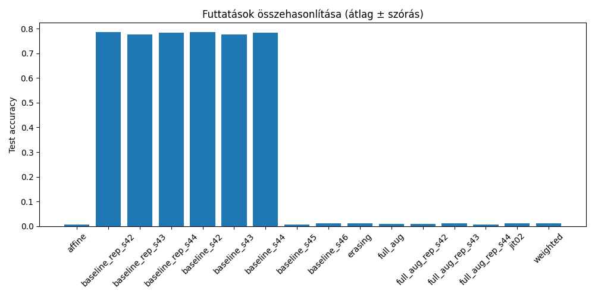
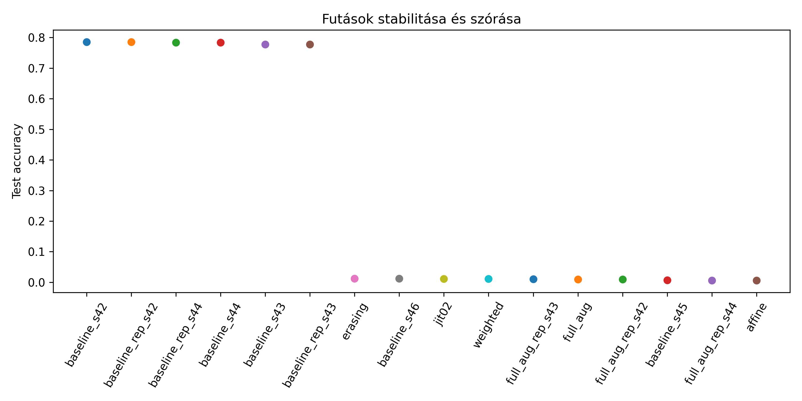
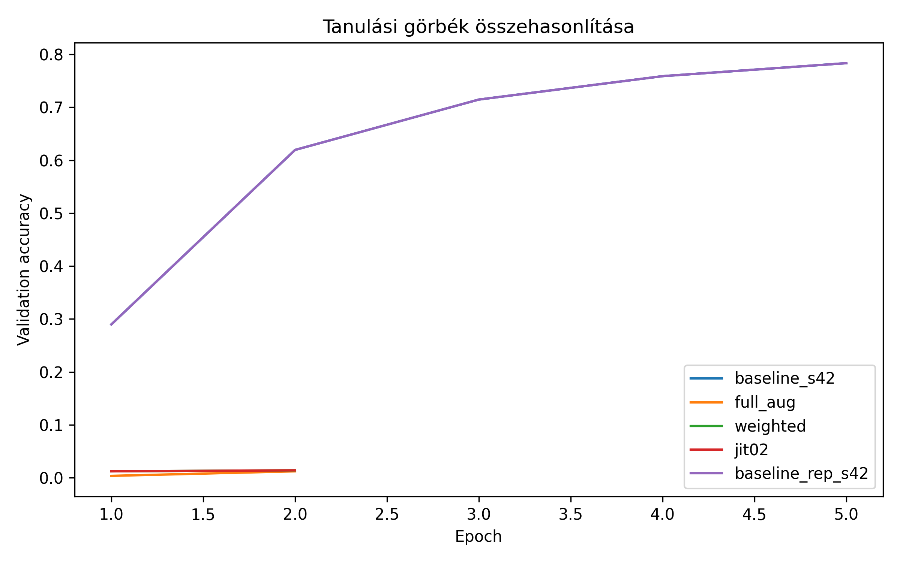
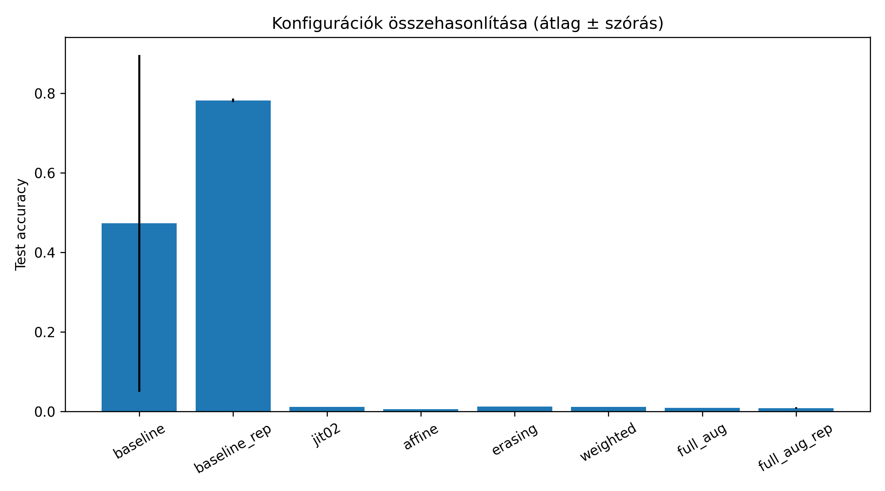
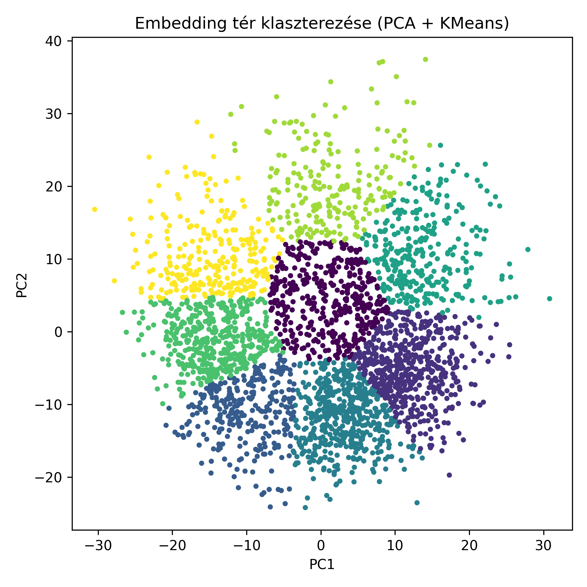
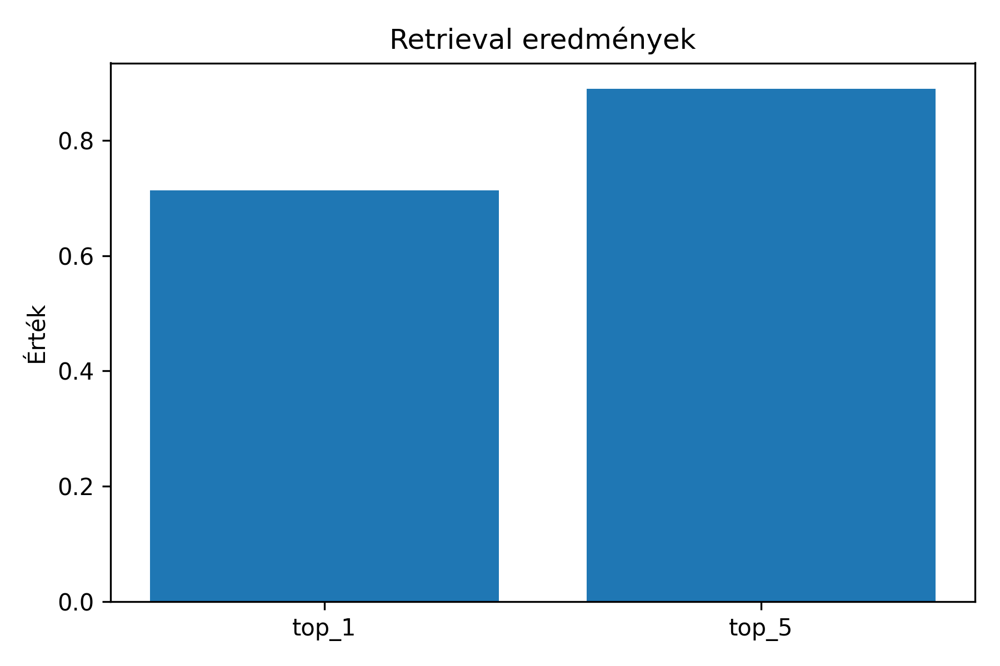

# Stanford Cars – Modell összehasonlítás és elemzés

1. Projekt áttekintés
   Stanford Cars – Deep Learning alapú képosztályozás és elemzés
   A projekt célja a Stanford Cars dataset segítségével különböző deep learning modellek teljesítményének vizsgálata, valamint a tanult reprezentációk elemzése.
      A munka két fő részből áll:
       -  Modellek tanítása és összehasonlítása
       -  Feature-alapú elemzések (clustering, retrieval, Grad-CAM)
2. Dataset
   A projekt a Stanford Cars datasetet használja, amely:
       -  Több mint 16 000 autóképet tartalmaz
       -  196 különböző osztályba sorolva
       -  Train / Test felosztással
   
3. Modell tanítás (összehasonlítás)
    Több kísérlet került lefuttatásra különböző beállításokkal:
     - baseline modellek (különböző seed-ekkel)
     - augmentációs technikák:
         -  color jitter
         -  affine transformáció
         -  random erasing
         -  weighted sampling
    Minden futás során rögzítésre kerültek:
      - train / validation metrikák
      - test accuracy
      - tanulási görbék
      - futási idő
        
4. Eredmények (ábrák)
   - Futtatások összehasonlítása:
    
   - Stabilitás vizsgálat:
   
   - Tanulási görbék:
    
   - Konfigurációk összehasonlítása: !
   
  
5. Feature-alapú elemzés
   A legjobb modell embeddingjei alapján további elemzések készültek.
     -  KMeans klaszterezés (PCA vizualizációval):
        
     -  Retrieval teljesítmény (Top-k):
       
  A modell képes hasonló autókat visszakeresni a tanult reprezentációk alapján.

6. Főbb megállapítások
   -  A baseline modellek stabil, de közepes teljesítményt nyújtanak
   -  Egyes augmentációk javíthatják a generalizációt
   -  A modellek stabilitása jelentős mértékben függ a seed-től
   -  Az embeddingek jól használhatók:
      -  klaszterezésre
      -  hasonlósági keresésre


7. Projektstruktúra
 ```plaintext
stanford-cars-ai/
│
├── notebooks/
│   └── osszehasonlitas.ipynb
│
├── outputs/
│   └── plots/
│       ├── run_comparison.png
│       ├── stability_plot.png
│       ├── training_curves.png
│       ├── kmeans_clusters.png
│       ├── configuration_comparison.png
│       └── retrieval_metrics.png
│
├── results/
│   └── *.csv
│
└── README.md
 ```
8.  Futtatás

A projekt Google Colab környezetben készült.

Futtatás lépései:

1. Notebook megnyitása
2. Runtime indítása (GPU ajánlott)
3. Cellák futtatása sorrendben

9.  Használt technológiák

- PyTorch
- timm
- scikit-learn
- matplotlib
- pandas


10.  Megjegyzés

A modell fájlok (.pt) méretük miatt nem kerültek feltöltésre.
Az eredmények reprodukálhatók a notebook futtatásával.

Szerző: Tóthné Ondrék Marianna_GX1OW5 
programtervező informatikus (levelező)
Eszterházy Károly Katolikus Egyetem

Szakdolgozati projekt – Finom-granularitású képosztályozás neurális hálózatokkal: hasonló objektumok megkülönböztetésének nehézségei
